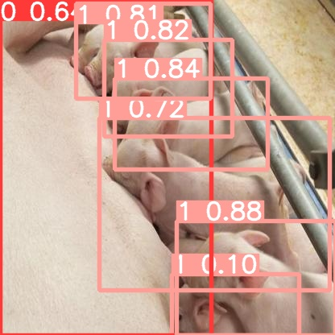

  <h1>Pig Detection</h1>
  
  

    The Winning solution to the Danish Championship in AI 2022
  

 

<!-- Table of Contents -->
# :notebook_with_decorative_cover: Table of Contents

- [About the Project](#star2-about-the-project)
  * [Tech Stack](#space_invader-tech-stack)
- [License](#warning-license)
- [Contact](#handshake-contact)
- [Acknowledgements](#gem-acknowledgements)
  

<!-- About the Project -->
## :star2: About the Project
The task was to detect identify the bounding boxes for all pigs and piglets in some unknown test data. For this task we chose to implement the YOLOv5 model developed by Facebook. The reason we chose this model was that there was a time constraint for how long to process each image. To train this model we had to scrape the internet for pictures of pigs and piglets and label them. After the training we had to deploy the model to a server for validation. Our final model achieved a maP of 0.947

<!-- Screenshots -->
### :camera: Screenshots

 
  
  
  
  
  
  
  
  
  

<!-- TechStack -->
### :space_invader: Tech Stack
* Python
* YOLOv5

<!-- License -->
## :warning: License

Distributed under the MIT License.
